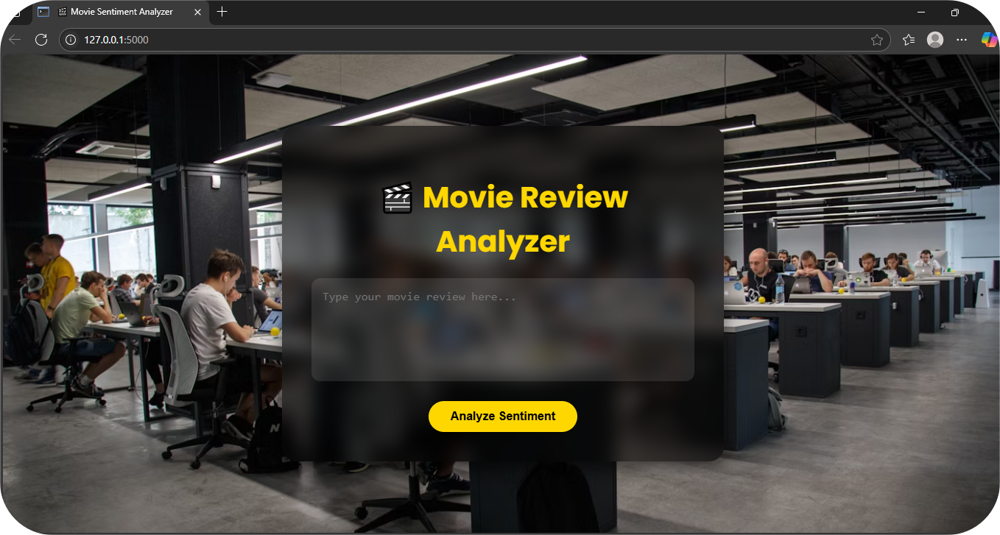

🎬 Movie Review Sentiment Analyzer

An AI-powered web application that classifies movie reviews as **Positive** or **Negative** using Natural Language Processing (NLP). Built with Python, trained on IMDB reviews, and deployed using a Flask web interface.

📌 Project Overview

This project demonstrates the power of text classification in Natural Language Processing. It uses machine learning to analyze user-submitted movie reviews and predicts the sentiment behind them — either *positive* or *negative*. The model is trained on real-world IMDB movie review data.

🔧 Tech Used

- Python – Core programming language
- Scikit - learn – Model training and vectorization
- Pandas – Data processing
- Flask  – Web framework
- HTML + CSS – Frontend design (with gradient + glassmorphism)
- Pickle – Model serialization

🚀 How to Run / Installation Instructions

1. Clone the repo
2. Install dependencies
3. Train the model
4. Run the app
5. View it in browser

📂 Project Structure

sentiment-analysis/
├── app.py
├── train_model.py
├── model/
├── data/
├── templates/
├── static/
└── README.md

🌟 Features

- Real-time sentiment prediction
- Stylish UI with background
- Trained on real IMDB reviews

📸 Screenshots

🏠 Home Page

🔍 Prediction Result

